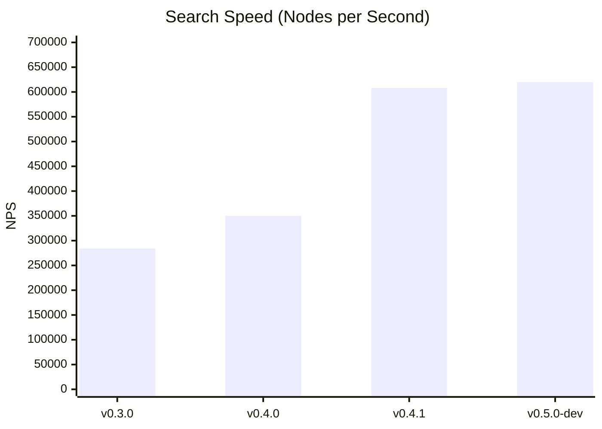

# Scacchista

[](https://github.com/gaspox/Scacchista/actions/workflows/ci.yml)
[](LICENSE)
[](https://www.rust-lang.org)
[](https://github.com/gaspox/Scacchista/releases)

A UCI-compliant chess engine written in Rust, featuring alpha-beta search with parallel lazy-SMP threading and hand-crafted evaluation.

## Features

### Search
- **Alpha-beta** with PVS (Principal Variation Search)
- **Aspiration windows** for iterative deepening
- **Quiescence search** for tactical stability
- **Pruning techniques**: null-move, LMR (Late Move Reductions), futility
- **Move ordering**: transposition table, MVV-LVA, killer moves, history heuristic
- **Lazy-SMP** parallel search (multi-threaded)

### Evaluation (HCE)
- Material + Piece-Square Tables (PSQT)
- King safety (castling rights, center exposure, pawn shield)
- Development penalties for unmoved pieces
- Center control
- Advanced passed pawn bonuses

### UCI Protocol
- Full UCI compliance
- Configurable options (Hash, Threads, Style, etc.)
- Support for FEN positions
- Time management (movetime, wtime/btime, increment)

## Quick Start

### Build

```bash
# Clone the repository
git clone https://github.com/gaspox/Scacchista.git
cd Scacchista

# Build release binary (optimized)
cargo build --release

# Binary location
./target/release/scacchista
```

### Run

```bash
# Interactive UCI mode
./target/release/scacchista

# Example UCI commands
uci
isready
position startpos moves e2e4 e7e5
go depth 10
quit
```

### Test

```bash
# Run all tests
cargo test

# Run perft tests specifically
cargo test --test perft_deep

# Run with verbose output
cargo test -- --nocapture
```

## Performance Evolution

Scacchista has seen significant performance improvements through data-driven optimization.



*Note: Benchmarks run on standard hardware (single thread) from startpos.*

### Perft Speed
~4.3M nodes/sec (Move Generation only)

## Demo

```text
> position startpos moves e2e4 c7c5
> go depth 10
info depth 1 seldepth 1 multipv 1 score cp 33 nodes 26 nps 26000 tbhits 0 time 1 pv g1f3
info depth 2 seldepth 2 multipv 1 score cp 45 nodes 84 nps 84000 tbhits 0 time 1 pv g1f3 d7d6
...
info depth 10 seldepth 14 multipv 1 score cp 28 nodes 154320 nps 615000 tbhits 1450 time 251 pv g1f3 d7d6 d2d4 c5d4 f3d4 g8f6 b1c3 a7a6 f1e2 e7e5
bestmove g1f3
```

### Strength Estimate

**ELO**: ~1260-1430 (estimated, based on tactical test suites)

**Note**: This is a hobby engine focused on clean architecture and educational value rather than maximum strength.

## Documentation

Detailed documentation available in [`docs/`](./docs/):

- [Architecture Overview](./docs/architecture/overview.md) - System design and module structure
- [Search Engine](./docs/search-engine.md) - Alpha-beta, pruning, move ordering
- [Evaluation](./docs/evaluation.md) - HCE components and PSQT
- [Threading](./docs/threading.md) - Lazy-SMP parallel search
- [UCI Options Reference](./docs/reference/uci-options.md) - Available configuration
- [Development Setup](./docs/development/setup.md) - How to contribute

## Development

### Prerequisites

- Rust 1.75 or later
- Cargo (comes with Rust)

### Project Structure

```
scacchista/
├── src/
│   ├── main.rs           # UCI loop entry point
│   ├── board.rs          # Bitboard representation
│   ├── eval.rs           # Hand-crafted evaluation
│   ├── search/           # Search engine modules
│   │   ├── search.rs     # Alpha-beta implementation
│   │   ├── thread_mgr.rs # Lazy-SMP threading
│   │   ├── tt.rs         # Transposition table
│   │   └── ...
│   ├── uci/              # UCI protocol
│   └── time/             # Time management
├── tests/                # Integration tests
├── docs/                 # Documentation
└── Cargo.toml
```

### Running Checks

```bash
# Format code
cargo fmt

# Lint
cargo clippy --all-targets --all-features -- -D warnings

# Build release
cargo build --release
```

## License

This project is licensed under the **GNU General Public License v3.0 or later** (GPL-3.0-or-later).

See [LICENSE](LICENSE) for details.

### License Note

Scacchista uses the [`shakmaty`](https://github.com/niklasf/shakmaty) crate (GPL-3.0), which means all derivative works (including compiled binaries) must also be GPL-3.0 compatible.

## Releases

See [Releases](https://github.com/gaspox/Scacchista/releases) for precompiled binaries.

Latest: **v0.5.0-dev** (Work in Progress) - Principal Variation Search (PVS) at root, Futility Pruning fix for mate scores, and major performance optimizations from v0.4.1.

See [v0.4.1](https://github.com/gaspox/Scacchista/releases/tag/v0.4.1) for the last stable version with capture-only qsearch, lock-free TT, and bitboard evaluation.

## Acknowledgments

- **shakmaty** by [@niklasf](https://github.com/niklasf) - Excellent Rust chess library for move validation
- Chess Programming Wiki - Invaluable resource for chess engine development
- Stockfish community - Inspiration and algorithmic insights

## Disclaimer

This is a personal learning project and experimental chess engine. It is **not intended for production use** or competitive play. The primary goals are:

- Educational: exploring chess engine algorithms and Rust programming
- Showcase: demonstrating software architecture and problem-solving skills
- Open Source: contributing to the Rust chess programming community

The engine prioritizes **code clarity and maintainability** over maximum playing strength.

---

**Made with Rust 🦀**
