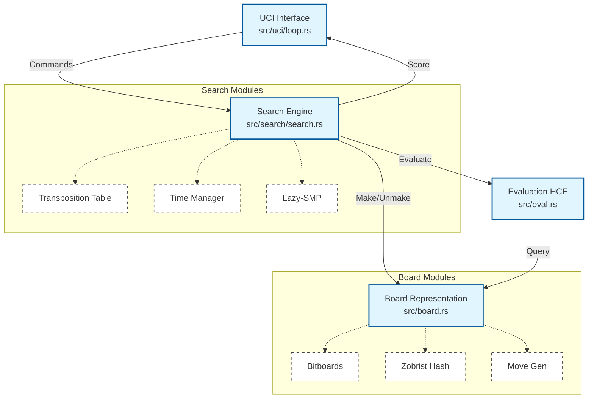
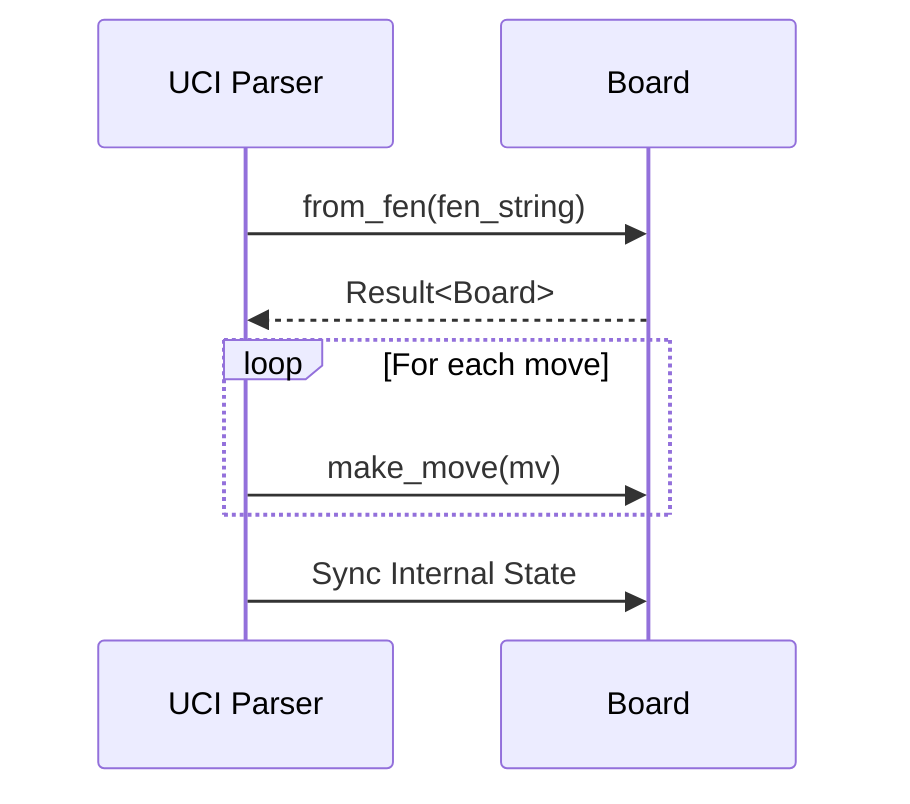
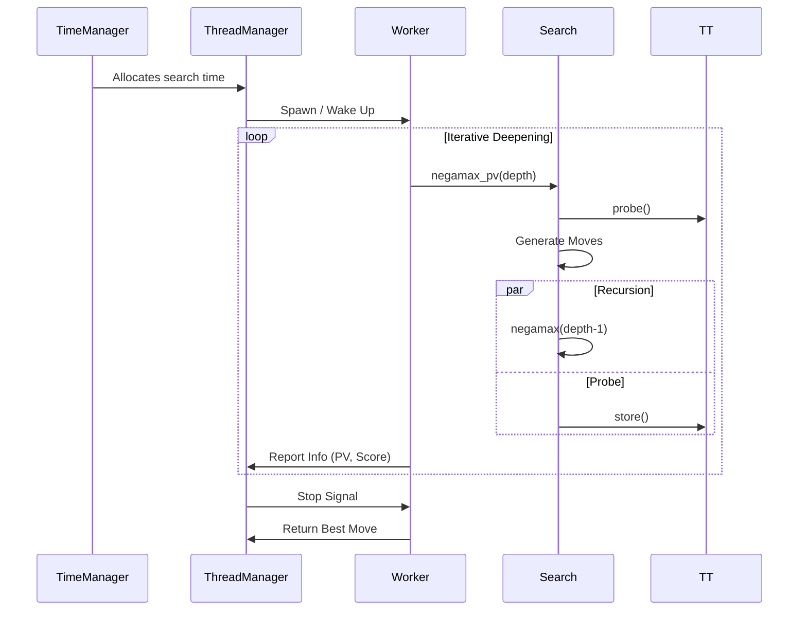

# Architecture Overview

This document describes the high-level architecture of the Scacchista chess engine.

## System Design

Scacchista is a UCI-compliant chess engine written in Rust, designed with a focus on performance and correctness. It follows a classical chess engine architecture with modern optimizations.



## Core Components

### 1. UCI Interface (`src/uci/`)

The Universal Chess Interface implementation handles communication with chess GUIs.

**Modules:**
- `loop.rs` - Main UCI command loop
- `parser.rs` - Command parsing and validation
- `options.rs` - UCI option definitions

**Key UCI Options:**
- `Hash` - Transposition table size (MB)
- `Threads` - Number of search threads
- `Style` - Playing style (Normal, Tal, Petrosian)
- `SyzygyPath` - Endgame tablebase path

See [UCI Options Reference](../reference/uci-options.md) for complete list.

### 2. Search Engine (`src/search/`)

Implements the core search algorithms.

**Features:**
- Iterative Deepening with Aspiration Windows
- Principal Variation Search (PVS)
- Quiescence Search with Stand-Pat
- Null-Move Pruning (R=2)
- Late Move Reductions (LMR)
- Futility Pruning
- Check Extensions

**Modules:**
- `search.rs` - Core alpha-beta implementation
- `tt.rs` - Transposition table
- `thread_mgr.rs` - Lazy-SMP parallel search
- `stats.rs` - Search statistics
- `params.rs` - Search parameters

See [Search Engine Details](./search-engine.md) for in-depth documentation.

### 3. Evaluation (`src/eval.rs`)

Hand-Crafted Evaluation (HCE) function with tapered scoring.

**Components:**
- Material counting with standard piece values
- Piece-Square Tables (PSQT) for positional bonuses
- King Safety (exposed king penalty, pawn shield bonus)
- Development Penalty (undeveloped pieces after move 10)
- Center Control (bonus for controlling central squares)

**Performance:**
- Fast evaluation: ~3us per position
- Simplified `evaluate_fast()` for quiescence search

See [Evaluation Details](./evaluation.md) for weights and tuning.

### 4. Board Representation (`src/board.rs`)

High-performance bitboard-based board representation.

**Structure:**
- 12 bitboards (one per piece type and color)
- Occupancy bitboards (white, black, all)
- Incremental Zobrist hashing
- Efficient make/unmake (~76ns per move pair)

**Move Generation:**
- Pseudo-legal generation with legality filtering
- Sliding piece attacks via loop-based calculation
- Special move handling (castling, en passant, promotion)

### 5. Thread Management (`src/search/thread_mgr.rs`)

Lazy-SMP parallel search implementation.

**Architecture:**
- Shared transposition table (Arc<Mutex<TT>>)
- Broadcast model (all workers search same position)
- Cooperative stop flags
- Result aggregation (best result wins)

See [Threading Details](./threading.md) for implementation notes.

## Data Flow

### Position Setup Flow



### Search Flow



## Dependencies

### Core Dependencies

| Crate | Purpose |
|-------|---------|
| `shakmaty` | Chess rules, FEN parsing, move validation |
| `shakmaty-uci` | UCI move parsing |
| `shakmaty-syzygy` | Syzygy tablebase probing |
| `serde` + `bincode` | Serialization for experience book |

### Why Hybrid Representation?

Scacchista uses `shakmaty` for correctness (parsing, validation) but maintains a separate internal board for search performance:

- **shakmaty**: Immutable, clone-based, safe
- **Internal Board**: Mutable, make/unmake, fast

This avoids cloning overhead during search while maintaining correctness guarantees at the UCI boundary.

## File Structure

```
src/
├── main.rs              # Entry point
├── lib.rs               # Module exports
├── board.rs             # Bitboard representation (~2000 lines)
├── eval.rs              # Evaluation function (~500 lines)
├── zobrist.rs           # Zobrist hashing tables
├── utils.rs             # Attack tables, utilities
├── uci/
│   ├── mod.rs          # Module re-exports
│   ├── loop.rs         # UCI main loop
│   ├── parser.rs       # Command parsing
│   └── options.rs      # UCI options
├── search/
│   ├── mod.rs          # Module re-exports
│   ├── search.rs       # Alpha-beta search (~1500 lines)
│   ├── tt.rs           # Transposition table
│   ├── thread_mgr.rs   # Lazy-SMP manager
│   ├── stats.rs        # Statistics tracking
│   └── params.rs       # Search parameters
├── time/
│   └── mod.rs          # Time management
└── bin/
    ├── perft.rs        # Move generation validation
    ├── simple_search_test.rs
    └── stress_search_test.rs
```

## Performance Characteristics

| Metric | Value | Notes |
|--------|-------|-------|
| Perft speed | ~4.3M nodes/sec | Move generation only |
| Search speed | ~608k nodes/sec | Full search with eval (v0.5.0) |
| make/unmake | ~76ns | Per move pair |
| TT probe | ~31ns | Hash lookup |
| Evaluation | ~3us | Full HCE |
| evaluate_fast | ~1us | Material + PSQT only |

See [Performance Reference](../reference/performance.md) for detailed benchmarks.

## Design Principles

1. **Correctness First**: All changes validated via perft and tactical tests
2. **Data-Driven Optimization**: Profile before optimizing
3. **Clean Architecture**: Clear separation of concerns
4. **Comprehensive Testing**: 90+ tests covering all components
5. **Incremental Development**: Small, well-tested changes

---

**Related Documents:**
- [Search Engine](./search-engine.md)
- [Evaluation](./evaluation.md)
- [Threading](./threading.md)
- [Development Setup](../development/setup.md)
