# Piano di Miglioramento Scacchista v0.5.0

Obiettivo: rendere il motore **più forte** (miglior gioco tattico e posizionale) e **più responsive** (nodi/secondo più alti, gestione tempo intelligente).

I miglioramenti sono ordinati per **impatto/sforzo**, dal più vantaggioso al più complesso.

## Stato Attuale (v0.5.0-dev) ✅
- **Fase 1 (Performance)**: Completata (Delta Pruning, TT Lock-free, Eval Bitboard).
- **Fase 2 (Forza Tattica)**: Completata (PVS Root, IIR, SEE Pruning, Countermove Heuristic). NPS 761k, 25.8% countermove effectiveness.
- **Fase 3.1 (Tapered Eval)**: Completata. Score{mg,eg}, PSQT PeSTO, game_phase(), interpolazione MG/EG. center_control() rimossa.
- **Prossimo Step**: Fase 3.2 (Struttura Pedonale).

---

## Fase 1 — Performance (Responsività) ⚡

Aumento immediato di nodi/s senza cambiare la logica di gioco.

> [!IMPORTANT]
> Queste ottimizzazioni sono prerequisiti: più nodi/s → depth più alta → motore più forte.

### Phase 1.1: Capture Generation (Dedicated) [COMPLETED]
#### [Modify] `src/board.rs`
- Add `generate_captures()` function
- Add helper functions for each piece type
- Optimize `qsearch()` to use this instead of full generation

### Phase 1.2: Delta Pruning [COMPLETED]
#### [Modify] `src/search/search.rs`
- Add delta pruning logic in `qsearch()` loop
- Skip captures where `stand_pat + victim_val + margin < alpha`

### Phase 1.3: Lock-free TT [COMPLETED]
#### [Modify] `src/search/tt.rs`
- Change storage to `Vec<AtomicU64>`
- Implement atomic pack/unpack logic
- Remove Mutex usage in `search.rs` and `thread_mgr.rs`

### Phase 1.4: Evaluation Optimization [COMPLETED]
#### [Modify] `src/eval.rs`
- Replace square-centric evaluation loop with bitboard operations
- Use popcount and bit manipulation for material counting
- Optimize mobility calculation using attack bitboards

---

## Fase 2 — Forza Tattica 🗡️

Miglioramento diretto della capacità di trovare combinazioni e mosse tattiche.

### 2.1 PVS (Principal Variation Search) corretto al root [COMPLETED]

#### [MODIFY] [search.rs](file:///home/gaspare/Documenti/TAL/Scacchista/src/search/search.rs#L347-L430)

Al root (`iddfs`), la prima mossa viene cercata con finestra piena, le successive con null-window `(-alpha-1, -alpha)` e re-search solo se fail-high. Attualmente tutte le mosse root usano finestra piena → spreco. Guadagno: **10-20% cutoff** in più.

> **CI Fixes (Fase 2.1.1)**: Risolti panic `i16::MIN`, bug TT bounds, e logic timeout score `-32000`. Test suite 81/81 passati.

### 2.2 IIR (Internal Iterative Reduction) [COMPLETED]

#### [MODIFY] [search.rs](file:///home/gaspare/Documenti/TAL/Scacchista/src/search/search.rs#L432-L818)

Se non c'è TT move al nodo PV con depth ≥ 4, ridurre depth di 1. Più semplice della vecchia IID e molto efficace. Guadagno: **5-10% nodi**.
- **Benchmark Update**: NPS 723k (+19% vs baseline), nodi corretti post-fix TT.
- **Prossimo Step**: Fase 2.4 (Countermove Heuristic). [TODO]

### 2.3 SEE Pruning per catture perdenti in qsearch [COMPLETED]

#### [MODIFY] [search.rs](file:///home/gaspare/Documenti/TAL/Scacchista/src/search/search.rs)

Non cercare catture su case difese dove *nessuna* cattura è vantaggiosa (Target-based pruning).
- **Fix**: Correzione logica SEE (backprop, pawn attacks).
- **Benchmark**: 5x speedup (25s -> 5s), nodi ridotti da 18.7M a 3.8M con NPS stabile (761k). Engine tatticamente più solido.

### 2.4 Countermove Heuristic [COMPLETED]

#### [MODIFY] [search.rs](file:///home/gaspare/Documenti/TAL/Scacchista/src/search/search.rs)

Aggiungere array `countermoves[piece][to_sq]`: quando una mossa produce beta-cutoff, memorizzare come "risposta" alla mossa precedente. Usato nel move ordering dopo killer moves. Costo: ~200 righe. Guadagno: **5-10 Elo**.
- **Benchmark**: Countermove Effectiveness 25.8% (cutoffs indotti).

---

## Fase 3 — Valutazione Posizionale 🧠 [TODO]

Eval più accurata = scelte strategiche migliori. Impatto stimato: **+80-130 Elo**.
NPS target: mantenere >550k (perdita max accettabile: ~25-30% da 761k).

Dipendenze: 3.1 è prerequisito di tutte le altre sotto-fasi.

```
3.1 Tapered Eval ──┬──> 3.2 Struttura Pedonale ──> 3.3 Pedoni Passati
                   ├──> 3.4 Coppia Alfieri
                   ├──> 3.5 Torre Colonna Aperta ──> 3.6 Torre 7a Traversa
                   ├──> 3.7 Mobilità ──> 3.8 Knight Outposts
                   ├──> 3.9 King Tropism
                   └──> 3.10 Space Advantage
```

| # | Sotto-fase | Elo | NPS cost | Priorità |
|---|---|---|---|---|
| 3.1 | Tapered Evaluation | +30-40 | ~1-2% | CRITICA |
| 3.2 | Struttura Pedonale | +15-25 | ~3-5% | ALTA |
| 3.3 | Pedoni Passati | +20-30 | ~3-4% | ALTA |
| 3.4 | Coppia Alfieri | +5-10 | <0.5% | MEDIA |
| 3.5 | Torre Colonna Aperta | +5-10 | ~1-2% | MEDIA |
| 3.6 | Torre 7a Traversa | +3-5 | <0.5% | MEDIA |
| 3.7 | Mobilità | +15-25 | ~8-12% | ALTA |
| 3.8 | Knight Outposts | +5-8 | ~1% | MEDIA |
| 3.9 | King Tropism | +5-8 | ~2-3% | BASSA |
| 3.10 | Space Advantage | +3-5 | ~1% | BASSA |

### 3.1 Tapered Evaluation (MG/EG) [COMPLETED]

#### [MODIFY] `src/eval.rs`

PREREQUISITO di tutto il resto. Struct `Score { mg: i32, eg: i32 }` con operatori aritmetici.
`game_phase()` basata su materiale (N=1, B=1, R=2, Q=4, totale=24).
PSQT doppie `[Score; 64]` per ogni pezzo (MG/EG). King EG con centralizzazione forte.
Valori materiali MG/EG differenziati (PeSTO-like).
`evaluate_fast()` aggiornata per usare PSQT tapered. Rimuovere `center_control()` (ridondante con mobilità).
- **Verification**: Unit tests passed (tapered interpolation, game phase, PSQT symmetry). Solid foundation established.

### 3.2 Struttura Pedonale (Isolated, Doubled, Backward) [TODO]

#### [MODIFY] `src/eval.rs`

Maschere `ADJACENT_FILES[8]`, `FILE_MASKS[8]` in utils.
Penalità: isolated s(5,15), doubled s(11,20), backward s(6,10).
Tutto bitboard-based (shift, AND, OR).

### 3.3 Pedoni Passati [TODO]

#### [MODIFY] `src/eval.rs`

Maschere `PASSED_PAWN_MASKS[color][64]` precalcolate.
Bonus per rank: rank2 s(5,10) → rank7 s(149,257).
Bonus extra per pedone passato supportato s(10,20).
Ridurre PSQT pedoni rank 5-7 del 50-60% per evitare doppio conteggio.

### 3.4 Coppia degli Alfieri [TODO]

#### [MODIFY] `src/eval.rs`

Bonus s(30,50) se ≥2 alfieri. Costo trascurabile.

### 3.5 Torre su Colonna Aperta/Semiaperta [TODO]

#### [MODIFY] `src/eval.rs`

Aperta (no pedoni): s(25,15). Semiaperta (solo pedoni nemici): s(13,8).

### 3.6 Torre su 7a Traversa [TODO]

#### [MODIFY] `src/eval.rs`

Bonus s(15,30) se re nemico su 8a o pedoni nemici su 7a. Si moltiplica per N torri.

### 3.7 Mobilità [TODO]

#### [MODIFY] `src/eval.rs`

Caselle safe (no pedoni amici, no attacchi pedoni nemici) raggiungibili da N/B/R/Q.
Tabelle lookup per pezzo: KNIGHT_MOBILITY[9], BISHOP_MOBILITY[14], ROOK_MOBILITY[15], QUEEN_MOBILITY[28].
Usa magic bitboards già disponibili. NON includere in `evaluate_fast()`.
Dopo implementazione: rimuovere `center_control()`.

### 3.8 Knight Outposts [TODO]

#### [MODIFY] `src/eval.rs`

Cavaliere su rank 4-6 avversaria, non attaccabile da pedoni nemici.
Bonus base s(30,15), +s(15,10) se supportato da pedone amico.

### 3.9 King Tropism [TODO]

#### [MODIFY] `src/eval.rs`

Distanza di Chebyshev dal re nemico, peso per pezzo (Q=5, N=3, B=2, R=2). Solo MG.

### 3.10 Space Advantage [TODO]

#### [MODIFY] `src/eval.rs`

Pedoni centrali (file c-f) avanzati oltre rank 3. Peso s(3,0). Solo MG. Opzionale.

---

## Fase 4 — Time Management Intelligente ⏱️ [TODO]

### 4.1 Soft/Hard Time Limit

#### [MODIFY] [time/mod.rs](file:///home/gaspare/Documenti/TAL/Scacchista/src/time/mod.rs)
#### [MODIFY] [search.rs](file:///home/gaspare/Documenti/TAL/Scacchista/src/search/search.rs)

- **Soft limit** (~50% del tempo allocato): non iniziare nuova iterazione ID se superato
- **Hard limit** (~200% del tempo allocato): abort immediato della ricerca

Attualmente c'è un solo limite → il motore o spreca tempo o lo finisce improvvisamente.

### 4.2 Score instability → tempo extra

Quando il best move cambia tra iterazioni consecutive, allocare il 50% di tempo extra. Evita di giocare mosse dubbie con poca fiducia.

---

## Fase 5 — Avanzato (Futuro) 🔮

| Intervento | Difficoltà | Impatto |
|---|---|---|
| NNUE Evaluation | Alta | +200 Elo |
| Syzygy Tablebases | Media | +20 Elo (finali) |
| Multi-PV per analisi | Bassa | UX |
| Pondering (think on opponent time) | Media | +30 Elo (tempo) |
| Opening Book | Bassa | +10 Elo (apertura) |

---

## Priorità di Implementazione Suggerita

```mermaid
graph LR
    A["1.1 generate_captures()"] --> B["1.2 Delta Pruning"]
    B --> C["1.4 evaluate_fast bitboard"]
    C --> D["2.1 PVS root"]
    D --> E["3.1 Tapered Eval"]
    E --> F["3.2 Mobilità"]
    F --> G["4.1 Soft/Hard Time"]
    G --> H["1.3 TT lock-free"]
    H --> I["2.2 IIR"]
    I --> J["2.4 Countermove"]
```



**Stima totale**: Fasi 1-4 → **+80-150 Elo** rispetto all'attuale v0.4.1.

## Verification Plan

### Automated Tests
- `cargo test` dopo ogni modifica
- Perft tests invariati (move generation non cambia nella Fase 1-3)
- Benchmark nodes/second prima e dopo ogni ottimizzazione performance
- WAC test suite (attualmente 0/2) — obiettivo post-Fase 2: ≥1/2

### Manual Verification
- Partite self-play (v0.5.0 vs v0.4.1) con `cutechess-cli`, ~100 partite a TC 10+0.1
- Confronto profondità raggiunta a parità di tempo in posizioni standard
